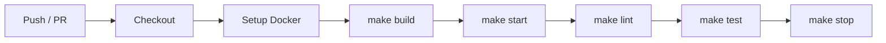

# GitHub Actions

## Hard rule

**Workflows must never duplicate lint/test/build commands.** Every CI step calls `make <target>`. If CI needs a new step, add a Makefile target first (see **makefile-operations**), then reference it in the workflow.

This guarantees local dev and CI run identical commands.

## Required Makefile targets (CI contract)

Before creating workflows, verify the project Makefile exposes:

| Target | CI usage |
|--------|----------|
| `make build` | Build Docker images |
| `make lint` | Lint backend + frontend |
| `make test` | Test backend + frontend |
| `make start` | Start stack (CI integration tests) |
| `make stop` | Tear down stack |

If any target is missing, create it via **makefile-operations** before writing workflows.

## Scaffold workflow

1. **Read** the project `Makefile` to identify available targets.
2. **Create** `.github/workflows/ci.yml` for PR/push checks.
3. **Create** `.github/workflows/main.yml` (optional) for main-branch builds.
4. **Verify** every `run:` step in YAML is `make <target>` — no bare `uv run`, `bun run`, `pytest`, or `ruff` commands.

## CI architecture

## Workflow templates

See [reference.md](reference.md) for full YAML files.

### ci.yml (PR + push)

Triggers on `pull_request` and `push` to `main`. Runs:

1. `make build`
2. `make start`
3. `make lint`
4. `make test`
5. `make stop` (always, via `if: always()`)

### main.yml (optional — main branch)

Triggers on `push` to `main`. Runs:

1. `make build`
2. Additional release/deploy targets if defined in Makefile (e.g. `make release`)

## Rules for workflow YAML

1. **No inline tool commands** — only `make <target>`.
2. **Use `docker compose`** via Makefile, not directly in YAML (except Docker setup step).
3. **Always tear down** with `make stop` in a final step with `if: always()`.
4. **Set env vars** from GitHub secrets only when the Makefile target expects them — do not pass secrets to ad-hoc commands.
5. **Pin action versions** (`actions/checkout@v4`, `docker/setup-buildx-action@v3`).
6. **Use `-T` flag** is handled inside Makefile targets (`exec -T`), not in workflow YAML.

## Adding a new CI step

When the user requests a new CI check (e.g. type checking, security scan):

1. Add a Makefile target: `typecheck-backend`, `typecheck-frontend`, or aggregate `typecheck`.
2. Add the target to the `lint` or `test` aggregate, or create a new aggregate.
3. Reference the aggregate in the workflow: `run: make typecheck`.

Never add the tool command directly to the workflow YAML.

## Backend-only / frontend-only projects

- Backend-only: workflow calls `make lint` and `make test` (Makefile aggregates skip missing frontend).
- Frontend-only: same pattern; Makefile aggregates skip missing backend.
- No Docker: use Makefile targets that run tools directly (still `make lint`, `make test`).

## Integration with sibling skills

| Skill | Role |
|-------|------|
| makefile-operations | Defines the CI contract targets |
| dockerization-template | Docker setup that `make build` / `make start` use |
| project-scaffold | Invokes this skill as final scaffold step |

## Additional resources

- Full workflow YAML templates: [reference.md](reference.md)
