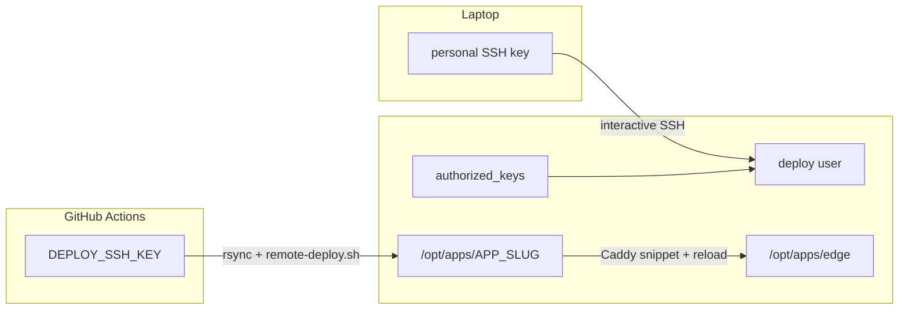
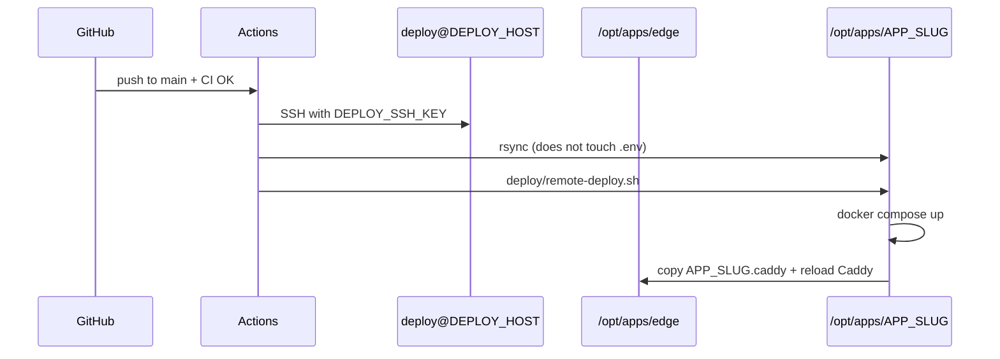

# Hetzner deploy

One VPS, one `deploy` user, one shared Caddy on `:80`/`:443`. Each GitHub repo
gets its own folder, loopback ports, Caddy snippet, and `.env` on the server.

Nothing below is provisioned by Hetzner. You define it once on the VM and in GitHub.

## Placeholders (never real values in this skill)

| Placeholder | Meaning |
|-------------|---------|
| `APP_SLUG` | kebab-case app name (directory, compose project, Caddy snippet) |
| `APP_HOSTNAME` | public hostname (subdomain or domain) |
| `DEPLOY_HOST` | VPS public IPv4 |
| `DEPLOY_USER` | Linux user for deploys (convention: `deploy`) |
| `DEPLOY_PATH` | `/opt/apps/APP_SLUG` |
| `WEB_LOOPBACK_PORT` | host port bound to `127.0.0.1` for the web container |
| `API_LOOPBACK_PORT` | host port bound to `127.0.0.1` for the API (full-stack only) |
| `DEPLOY_SSH_KEY` | **private** key GitHub Actions uses to SSH as `deploy` |

**Never write real IPs, hostnames, private keys, or production secrets into this
skill, into examples, or into git.** Use placeholders here. Put real values only
in GitHub Secrets/Variables and in the server-side `.env` (not committed).

## Model



On the server:

```
/opt/apps/
  edge/                 ← shared Caddy (80/443, TLS). One per machine.
  APP_SLUG/             ← this repo (.env lives here, never in git)
  OTHER_SLUG/           ← next repo (other .env, other ports, other snippet)
```

Laptop key → interactive `root` or `deploy`. Actions key → `deploy` only, for
rsync + `docker compose`.

## Intake (ask before writing files)

Do not guess collision-prone values. Ask:

1. **`APP_SLUG`** — folder under `/opt/apps/`.
2. **`APP_HOSTNAME`** — DNS name that will point at this VPS.
3. **Stack**: `frontend-only` | `full-stack` | `static`.
4. **New VPS or existing?** Bootstrap (`deploy` user, Docker, `/opt/apps/edge`)
   runs **once per machine**. Skip if already done.
5. **Loopback ports** — unused on this VPS. Suggest a pair; do not reuse another
   app’s ports.
6. **SSH key** — reuse the existing Actions key (same `DEPLOY_SSH_KEY`, new
   `DEPLOY_PATH`) or generate a per-repo key.

Then fill the planning table (placeholders only in chat if the user has not
given values yet):

| Decision | This app |
|----------|----------|
| `DEPLOY_PATH` | `/opt/apps/APP_SLUG` |
| Hostname | `APP_HOSTNAME` |
| Loopback | `WEB_LOOPBACK_PORT` (and `API_LOOPBACK_PORT` if full-stack) |
| Compose project | `APP_SLUG` |
| Caddy snippet | `deploy/host/edge/sites/APP_SLUG.caddy` |

## What to add in the app repo

Copy/adapt templates from [reference.md](reference.md):

1. **`compose.prod.yaml`** — prod services; publish only `127.0.0.1:PORT:…`;
   names/networks/volumes prefixed with `APP_SLUG`.
2. **`deploy/remote-deploy.sh`** — `docker compose -f compose.prod.yaml up`,
   copy Caddy snippet into `/opt/apps/edge/sites/`, reload Caddy.
3. **`deploy/host/edge/sites/APP_SLUG.caddy`** — `APP_HOSTNAME` →
   `host.docker.internal:WEB_LOOPBACK_PORT` (and API if needed).
4. **`.github/workflows/deploy.yml`** — after CI: SSH, rsync (**exclude `.env`**),
   run `remote-deploy.sh`. `DEPLOY_PATH` = `/opt/apps/APP_SLUG`.
5. **`deploy/env.production.example`** — documented keys only; real `.env` is
   created on the server and never committed.

If this is the **first** app on a new VPS, also add bootstrap + edge templates
from reference (run bootstrap **once**).

## Deploy flow



## GitHub Secrets / Variables (per repo)

| Name | Kind | Value |
|------|------|--------|
| `DEPLOY_HOST` | secret or variable | VPS public IPv4 |
| `DEPLOY_USER` | secret or variable | `deploy` |
| `DEPLOY_SSH_KEY` | **secret** | Actions private key (PEM/openssh) |
| `DEPLOY_PATH` | **variable** | `/opt/apps/APP_SLUG` |
| `DEPLOY_SSH_PORT` | variable (optional) | usually `22` |

Reuse host + user across repos on the same VPS. Change **`DEPLOY_PATH`** every
time. Reusing `DEPLOY_SSH_KEY` is fine; a per-repo key is optional (see
[examples.md](examples.md)).

## First time on the server (manual)

Bootstrap once per machine if needed: `bash deploy/bootstrap.sh`.

Then for **this** app:

```bash
# as a user who can chown /opt/apps
mkdir -p /opt/apps/APP_SLUG
chown deploy:deploy /opt/apps/APP_SLUG
```

Seed `.env` **on the server** from the example (never from git history):

```bash
cp /opt/apps/APP_SLUG/deploy/env.production.example /opt/apps/APP_SLUG/.env
chmod 600 /opt/apps/APP_SLUG/.env
# edit real values on the server only
```

DNS: one **A** record, `APP_HOSTNAME` → the same `DEPLOY_HOST`. Do not also
point that hostname at Vercel (or another PaaS).

Firewall: **22, 80, 443** only. Do not expose loopback app ports.

## Hard rules

1. **One edge per machine** — do not install a second Caddy/nginx that binds 80/443.
2. **Apps bind loopback only** — `127.0.0.1:WEB_LOOPBACK_PORT:…`, never `0.0.0.0`.
3. **`.env` is server-local** — rsync must exclude it; Actions must not scp it.
4. **New app = new folder + new ports + new Caddy snippet + new DNS.** Same VPS,
   same `deploy` user. Do not repeat bootstrap.
5. **Do not commit secrets** — no private keys, no production `.env`, no real
   `DEPLOY_HOST` inside this skill.
6. **CI stays Makefile-based** (see **github-actions**). Deploy is a separate
   workflow: rsync + `remote-deploy.sh`.
7. **Prod compose is not the dev compose** — local `compose.yaml` stays with
   **dockerization-template**; this skill owns `compose.prod.yaml`.

## Second (or Nth) repo on the same VPS

Same IP, same `deploy` user, same edge. Follow [examples.md](examples.md).
Short checklist:

1. Same `DEPLOY_HOST` / `DEPLOY_USER` (same or new `DEPLOY_SSH_KEY`).
2. New `DEPLOY_PATH` = `/opt/apps/NEW_SLUG`.
3. New folder under `/opt/apps/`, new loopback ports, new `sites/NEW_SLUG.caddy`.
4. New DNS A record → same IP.
5. Own `.env` on the server.

## Sibling skills

| Skill | Role |
|-------|------|
| dockerization-template | Local `compose.yaml`; this skill adds `compose.prod.yaml` |
| github-actions | CI via `make`; this skill adds `deploy.yml` after CI |
| env-secrets | `.env` gitignore contract; production `.env` lives on the VPS |

## Additional resources

- File templates (compose, Caddy, bootstrap, workflow, remote script): [reference.md](reference.md)
- Second-app walkthrough, key options, port picking: [examples.md](examples.md)
