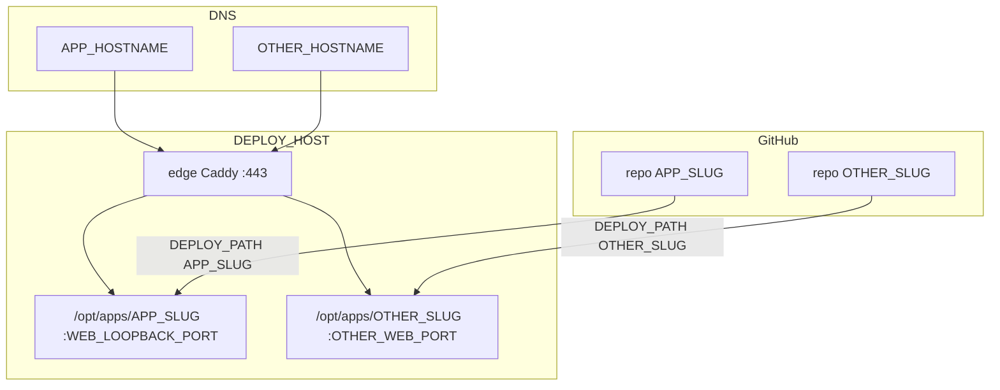

# Hetzner deploy — repeating the layout

Worked examples use **only placeholders**. Substitute the operator’s values when
applying this to a real repo. Never copy a real IP, hostname, or key into git.

## Two repos, one VPS



Same VM, same `deploy` user, same edge. Different folder, hostname, loopback
ports, Caddy snippet, and `.env`.

---

## Adding a second app (same Hetzner)

Bootstrap is **already done**. Do not run `deploy/bootstrap.sh` again.

### 1. Plan

| Decision | First app | Second app |
|----------|-----------|------------|
| Folder | `/opt/apps/APP_SLUG` | `/opt/apps/OTHER_SLUG` |
| Hostname | `APP_HOSTNAME` | `OTHER_HOSTNAME` |
| Loopback | `WEB_LOOPBACK_PORT` (and API if any) | **unused** ports, e.g. next free pair |
| Compose project | `APP_SLUG` | `OTHER_SLUG` |
| Caddy snippet | `sites/APP_SLUG.caddy` | `sites/OTHER_SLUG.caddy` |
| GitHub `DEPLOY_PATH` | `/opt/apps/APP_SLUG` | `/opt/apps/OTHER_SLUG` |
| `DEPLOY_HOST` / `DEPLOY_USER` | same | same |

Pick ports that are not already bound on the VPS (`ss -lnt` as `deploy`). A
simple convention: web `31xx`/`32xx`/… and API `81xx`/`82xx`/… — only a
convention, not a requirement.

### 2. SSH key for the new GitHub repo

**Option A — reuse** (simplest): copy the existing `DEPLOY_HOST`, `DEPLOY_USER`,
and `DEPLOY_SSH_KEY` into the new repo. Change only `DEPLOY_PATH`.

**Option B — per-repo key:**

```bash
ssh-keygen -t ed25519 -f ~/.ssh/OTHER_SLUG_deploy -C "github-actions-OTHER_SLUG" -N ""
```

On the VPS, append the **public** line to `/home/deploy/.ssh/authorized_keys`.
In the new repo, secret `DEPLOY_SSH_KEY` = contents of the **private** file.

### 3. Files in the new repo

Same set as the first app, with `OTHER_SLUG` / `OTHER_HOSTNAME` / new ports:

- `compose.prod.yaml`
- `deploy/remote-deploy.sh`
- `deploy/host/edge/sites/OTHER_SLUG.caddy`
- `.github/workflows/deploy.yml` (`DEPLOY_PATH`, environment URL)
- `deploy/env.production.example`

Do **not** copy edge `compose.yaml` / bootstrap unless this repo is meant to be
the machine’s bootstrap source. One edge is enough.

### 4. First time on the server for the new folder

```bash
mkdir -p /opt/apps/OTHER_SLUG
chown deploy:deploy /opt/apps/OTHER_SLUG
```

After the first rsync (Actions or a manual rsync that **excludes** `.env`):

```bash
cp /opt/apps/OTHER_SLUG/deploy/env.production.example /opt/apps/OTHER_SLUG/.env
chmod 600 /opt/apps/OTHER_SLUG/.env
# edit /opt/apps/OTHER_SLUG/.env on the server
```

If `remote-deploy.sh` did not install the snippet yet:

```bash
cp /opt/apps/OTHER_SLUG/deploy/host/edge/sites/OTHER_SLUG.caddy /opt/apps/edge/sites/
docker compose -f /opt/apps/edge/compose.yaml --env-file /opt/apps/edge/.env \
  exec -T caddy caddy reload --config /etc/caddy/Caddyfile
```

### 5. DNS

| Type | Name | Value |
|------|------|--------|
| A | host label for `OTHER_HOSTNAME` | same `DEPLOY_HOST` as the first app |

Do not also attach that hostname to Vercel or another PaaS.

### 6. Firewall

Unchanged: 22, 80, 443. Do not open the new loopback ports.

---

## Stack variants (what the agent writes)

Ask which of these matches the new repo, then use the matching templates in
[reference.md](reference.md).

| Stack | compose.prod.yaml | Caddy | Ports to reserve |
|-------|-------------------|-------|------------------|
| Frontend-only | `web` on loopback | one hostname → web port | `WEB_LOOPBACK_PORT` |
| Full-stack | `web` + `api` + internal `db` | hostname → web; API host or `/api/*` | web + API |
| Static | static file server on loopback | one hostname → web port | `WEB_LOOPBACK_PORT` |

If the operator gives **slug + hostname + stack**, fill the planning table and
emit the files. Do not invent a second VPS.

---

## What stays shared vs what is per app

| Shared (one per VPS) | Per app (one per GitHub repo) |
|----------------------|-------------------------------|
| VPS / `DEPLOY_HOST` | `DEPLOY_PATH` (`/opt/apps/SLUG`) |
| User `deploy` | Loopback ports |
| Docker engine | `compose.prod.yaml` project name |
| `/opt/apps/edge` Caddy | `sites/SLUG.caddy` |
| Firewall 22/80/443 | DNS hostname |
| Optional: one Actions SSH key | Server `.env` |

---

## Quick checklist (Nth repo)

1. Same IP → same `DEPLOY_HOST`.
2. Same user `deploy` → same or new `DEPLOY_SSH_KEY`.
3. New `DEPLOY_PATH` in the new repo’s GitHub Variables.
4. New directory under `/opt/apps/`.
5. New loopback ports + new Caddy snippet.
6. New DNS A record → same IP.
7. Own `.env` on the server (GitHub must not overwrite it).

---

## Agent do / don’t

**Do**

- Ask for slug, hostname, stack, and free ports.
- Exclude `.env` from rsync.
- Bind app ports to `127.0.0.1`.
- Reload the **existing** edge Caddy; do not start a second proxy on 80/443.

**Don’t**

- Repeat bootstrap on a machine that already has `/opt/apps/edge`.
- Commit `DEPLOY_SSH_KEY`, production `.env`, or a real `DEPLOY_HOST` into the
  skill or the app repo.
- Publish Postgres or app ports on `0.0.0.0`.
- Point the new hostname at Vercel **and** this VPS.
