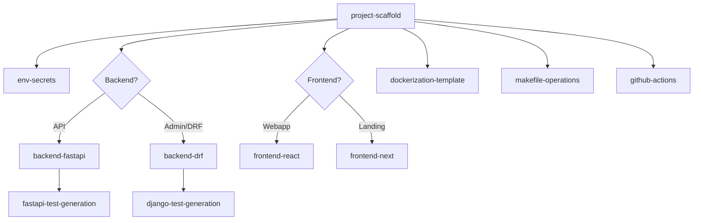

# Project Scaffold

Orchestrator skill that creates a complete project following the framework conventions. Chains sibling skills in the correct order.

## Mandatory intake (ask before scaffolding)

Do not assume — ask the user:

1. **Project slug** (e.g. `acme`, `finkelly`) — used for Docker service names, DB name, env vars.
2. **Backend type**:
   - **FastAPI** (default) — lightweight REST APIs
   - **DRF** — Django admin, complex permissions, heavy ORM workflows
3. **Frontend type**:
   - **React** (Vite) — webapps, dashboards, SPAs
   - **Next** — landing pages, marketing sites, SSR
   - **None** — backend-only
4. **Include Docker + Postgres?** (default: yes)

## Root layout produced

```
PROJECT_ROOT/
├── .envrc                 # committed — direnv loader
├── .env_template          # committed — documented keys
├── .env                   # gitignored — local secrets (user creates)
├── .gitignore             # from env-secrets reference
├── backend/
├── frontend/              # omitted if backend-only
├── docker/
│   ├── backend.Dockerfile
│   ├── frontend.Dockerfile
│   └── postgresql.Dockerfile
├── .github/
│   └── workflows/
│       ├── ci.yml
│       └── main.yml
├── Makefile
└── compose.yaml
```

## Scaffold sequence

Execute in this order, reading and applying each sibling skill:

| Step | Skill | Action |
|------|-------|--------|
| 1 | `env-secrets` | `.envrc`, `.env_template`, `.gitignore` |
| 2 | `backend-fastapi` or `backend-drf` | Backend stubs + pyproject.toml |
| 3 | `frontend-react` or `frontend-next` | Frontend dir + human-init commands (skip if no frontend) |
| 4 | `dockerization-template` | Dockerfiles + compose.yaml |
| 5 | `makefile-operations` | Makefile with CI-facing targets |
| 6 | `github-actions` | Workflows calling only `make` targets |
| 7 | (this skill) | Print human-init checklist |

## Step 1 — Environment and gitignore

Read and apply **env-secrets** with `PROJECT_SLUG` from intake. Creates `.envrc`, `.env_template`, and `.gitignore`. Do not create `.env` — the user copies from template after scaffold.

See [env-secrets/reference.md](../env-secrets/reference.md) for file templates.

## Step 2 — Backend

Based on intake answer:

- **FastAPI** → read and apply **backend-fastapi**
- **DRF** → read and apply **backend-drf** (human-only Django init)

## Step 3 — Frontend

Based on intake answer:

- **React** → read and apply **frontend-react** (human-only bun create)
- **Next** → read and apply **frontend-next** (human-only bun create)
- **None** → skip

## Step 4 — Docker

Read and apply **dockerization-template** with:

- `PROJECT_SLUG` from intake
- Backend variant: `fastapi` or `drf`
- Frontend variant: `react`, `next`, or omit frontend service

## Step 5 — Makefile

Read and apply **makefile-operations**. Use the reference template matching the backend/frontend choices. Ensure these CI targets exist:

- `build`, `start`, `stop`
- `lint`, `lint-backend`, `lint-frontend`
- `test`, `test-backend`, `test-frontend`

## Step 6 — GitHub Actions

Read and apply **github-actions**. Create `.github/workflows/ci.yml` (and optionally `main.yml`). Every step must call `make <target>`.

## Step 7 — Human-init checklist

After all files are created, print a single checklist for the user. Adapt based on choices:

### FastAPI + React example

```
## You run these (agent cannot execute):

### Backend
cd backend
uv sync

### Frontend
bun create vite frontend --template react-ts
cd frontend
bun install
bunx --bun shadcn@latest init
bun add lucide-react

### Environment (direnv)
cp .env_template .env
# edit .env with your local values
direnv allow .

### Start development
make build
make start
```

### DRF + Next example

```
## You run these (agent cannot execute):

### Backend
cd backend
uv init --no-readme
uv add django djangorestframework psycopg[binary] python-dotenv
uv add --dev ruff factory-boy
uv run django-admin startproject config .
uv run python manage.py startapp users api/users

### Frontend
bunx create-next-app@latest frontend --typescript --tailwind --eslint --app --src-dir --import-alias "@/*" --use-bun
cd frontend
bunx --bun shadcn@latest init
bun add lucide-react

### Environment (direnv)
cp .env_template .env
# edit .env with your local values
direnv allow .

### Start development
make build
make start
```

## Decision guide (for intake questions)

Help the user choose backend:

| Signal | Recommendation |
|--------|---------------|
| Simple CRUD API, microservice | FastAPI |
| Needs Django admin panel | DRF |
| Complex role-based permissions with Django ecosystem | DRF |
| Async-heavy, OpenAPI-first | FastAPI |
| Team knows Django well | DRF |

Help the user choose frontend:

| Signal | Recommendation |
|--------|---------------|
| Dashboard, SPA, rich client state | React (Vite) |
| Landing page, marketing, SEO | Next |
| Blog, docs site with SSG | Next |
| Internal tool, no SEO needs | React (Vite) |

## Sibling skill map



## Rules

1. **Never execute** human-only commands (`django-admin`, `bun create`, `shadcn init`, `direnv allow`).
2. **Always ask** intake questions before scaffolding — do not guess.
3. **Always chain** sibling skills rather than inlining their content.
4. **Always create** CI-facing Makefile targets before GitHub Actions workflows.
5. **Always print** the human-init checklist at the end.

## Additional resources

- Intake question templates: [reference.md](reference.md)
- Env/gitignore templates: [env-secrets/reference.md](../env-secrets/reference.md)
